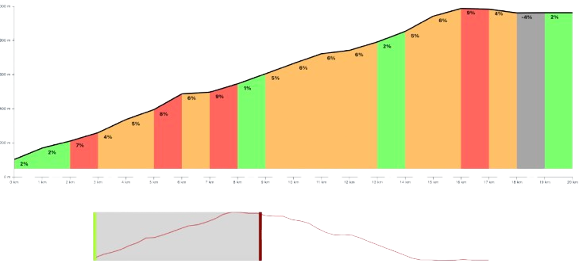

<div align="center">
 
</div> 
<br/> 

<div align="center">
Generate a climb profile from a GPX file. 
</div> 
<br /> 


<br/>
<div align="center">
👉 See it live in action <a href="https://hbulens.github.io/climbprofile/
" target="_blank">here</a> 👈 . 
</div> 


## Project Overview

This project allows users to generate detailed climb profiles from GPX files. It's designed for cyclists, hikers, and outdoor enthusiasts who need to visualize elevation data and understand the difficulty of different routes. The application processes GPX files and outputs a graphical profile of the climb, helping users to plan and prepare for their activities.
Features

- GPX File support: Easily upload and process GPX files to generate climb profiles.
- Interactive graphs: View detailed climb profiles with interactive graphs showing elevation changes.
- Customizable output: Adjust settings for the climb profile to focus on specific sections or data points.

## Prerequisites

Before setting up the project, ensure you have the following installed:

- Node.js (v16 or higher)
- Bun (for managing the project)

## Local Development

To set up and run the project locally, follow these steps:

1. Clone the repository:

``` bash
git clone https://github.com/hbulens/climbprofile
cd climbprofile
```

2. Install dependencies:

```bash
bun i
```

3. Start the Local Web Server:

```bash
bun dev
```

The server will start at http://localhost:5173. 
Open this URL in your browser to use the application.

## Usage

Once the server is running:

- Upload a GPX file: Click the upload button and select a GPX file from your computer.
- Generate climb profile: The application will process the file and display the climb profile.
- Interact with the graph: Use your mouse to hover over sections of the graph for detailed elevation data.

## Contribute

We welcome contributions! To contribute:

- Fork the repository.
- Create a new branch (git checkout -b feature-name).
- Make your changes and commit them (git commit -m 'Add some feature').
- Push to the branch (git push origin feature-name).
- Create a pull request.

Please ensure your code adheres to the project's coding standards and includes relevant tests.

## Testing

To run the tests:

```bash
bun test
```

Make sure all tests pass before submitting a pull request. Add new tests if you introduce new features or modify existing ones.

## Deployment

To deploy the project, follow these steps:

1. Build the Project:
    ```bash
    bun build
    ```
2. Set up the production environment: Configure necessary environment variables.
3. Deploy to Your preferred hosting service: Copy the build files to your server or use a deployment service like Vercel or Netlify.

## Support

If you encounter any issues or have questions, feel free to open an issue on GitHub.

## Roadmap

Planned features for future releases include:

- GPX data analysis: Add more detailed data analysis, such as speed and heart rate integration.
- Profile sharing: Enable users to share generated climb profiles on social media.
- Multi-language support: Add support for multiple languages.

## Acknowledgments

This project was inspired by the need for accurate climb profiles for outdoor activities. We thank all contributors and the open-source community for their valuable input.

## License

This project is licensed under the MIT License - see the LICENSE file for details.